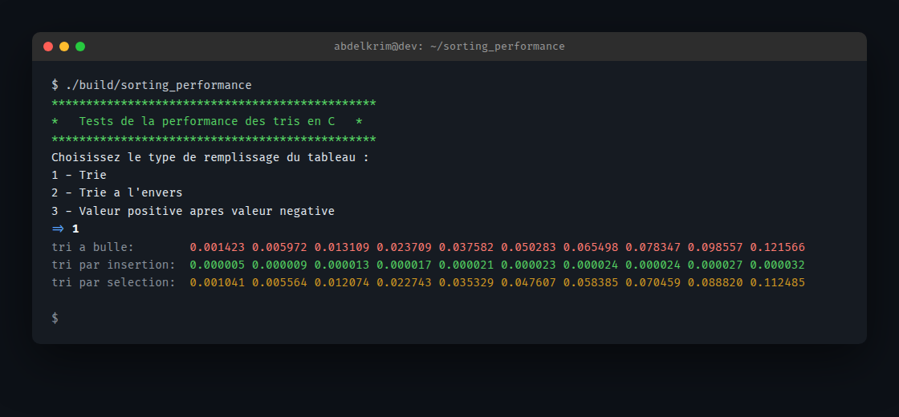
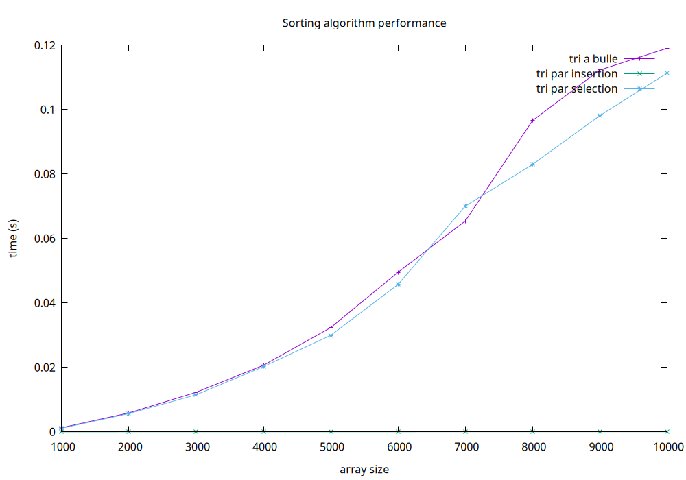

<div align="center">

# Sorting Performance Lab

Benchmark bubble, insertion, and selection sort against different input shapes and plot the results.

[](https://github.com/Abdelkrim7Be/Sorting_Performance_Mesuring/actions/workflows/ci.yml)
[](LICENSE)


</div>

## Overview

This project measures and compares the runtime of three classic sorting algorithms (bubble, insertion, selection) on arrays of growing size, under three input shapes: already ascending, fully descending, and alternating sign. It times each run, smooths the series, prints a results table, and renders a performance chart with gnuplot.

## Features

- Three sorting algorithms benchmarked side by side
- Three fill modes: ascending, descending, alternating positive/negative
- Timed runs across 10 array sizes (1000 to 10000, configurable)
- Simple moving-average smoothing on the timing series
- PNG chart output via gnuplot, no GUI required

## How it works

1. The user picks a fill mode at the prompt.
2. For each of 10 array sizes, a fresh array is allocated and filled, then each sort is timed with `clock()`.
3. The three timing series are smoothed with a 3-point moving average.
4. Results print to the terminal and are piped to gnuplot to produce `results.png`.

## Project structure

```
.
├── include/
│   ├── sorting_algorithms.h
│   ├── benchmark.h
│   └── plot.h
├── src/
│   ├── main.c
│   ├── sorting_algorithms.c
│   ├── benchmark.c
│   └── plot.c
├── CMakeLists.txt
└── .github/workflows/ci.yml
```

- `sorting_algorithms`: array fill + bubble/insertion/selection sort
- `benchmark`: timing and moving-average smoothing
- `plot`: gnuplot pipe, renders the PNG chart

## Build & run

Requires a C compiler, CMake, and gnuplot.

```bash
cmake -S . -B build -DCMAKE_BUILD_TYPE=Release
cmake --build build
./build/sorting_performance
```

Pick a fill mode when prompted. The program prints a timing table and writes `results.png` in the working directory.

## Sample output

<div align="center">

</div>

<div align="center">

</div>

### Interpretation

Numbers below are real runs on this machine, n from 1000 to 10000.

Ascending input (mode 1): insertion sort finishes in about 30 microseconds at n=10000, its best case, since every element is already in place and the inner shift loop never runs. Bubble and selection sort still take roughly 0.12s, because both compare every pair regardless of order: O(n^2) comparisons no matter how sorted the data already is.

Descending input (mode 2): the opposite extreme for insertion sort. Every element has to shift all the way to the front, so it degrades to O(n^2) and lands close to bubble sort, both around 1.35s at n=10000. Selection sort barely moves, about 0.09s, because its cost never depends on input order: it always scans for the minimum and performs at most one swap per pass.

Alternating sign input (mode 3): heavy disorder means many inversions, so bubble (0.80s) and insertion (0.65s) both do a lot of shifting and swapping, while selection sort again stays cheap (0.11s) for the same reason as above.

Same shape across all three: selection sort barely changes because it is insensitive to input order, Θ(n^2) comparisons and O(n) swaps every time. Bubble and insertion sort are order sensitive: close to O(n) on nearly sorted data, degrading to O(n^2) on reversed or heavily disordered data.

## Conclusion

For nearly sorted data, insertion sort wins outright: linear time, no wasted work. For reversed or adversarial input it loses that advantage and becomes one of the slowest options, tied with bubble sort. Selection sort is the most predictable of the three since its performance does not depend on input order, but that predictability comes from a fixed O(n^2) cost even in the best case. None of the three scale past a few tens of thousands of elements; the point of this project is to make that O(n^2) wall, and each algorithm's sensitivity to input order, visible as a measured curve instead of a theoretical claim.

## License

MIT license. Full text in [LICENSE](LICENSE).

